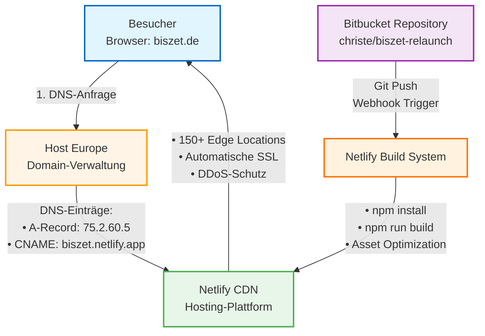

# Technologie-Dokumentation biszet Website

**Stand:** Dezember 2025  
**Version:** 2.0 (Next.js Relaunch)  

---

## Übersicht

Diese Dokumentation beschreibt die technische Architektur der biszet Website, die verwendeten Dienste und Deployment-Prozesse. Sie dient als Referenz für Entwickler, Administratoren und Stakeholder.

**Inhalt:**
- Eingesetzte Technologien und deren Begründung
- Infrastruktur-Architektur (Domain, Hosting, Repository)
- Zugangsdaten und Verwaltungsportale
- Deployment- und Wartungs-Workflows

---

## Projektübersicht

Die biszet Website (https://biszet.de) ist eine moderne, mehrsprachige (Deutsch/Englisch) Web-Präsenz für Ihren Luxus-Kosmetikkühlschrank. Die Website wurde 2024 komplett neu entwickelt und nutzt aktuelle Web-Technologien für:

- **Schnelle Ladezeiten:** Besucher sehen die Seite in unter 2 Sekunden
- **Suchmaschinenoptimierung:** Bessere Auffindbarkeit bei Google & Co.
- **Mobile-Optimierung:** Perfekte Darstellung auf Smartphones und Tablets
- **Wartbarkeit:** Einfache Pflege und Erweiterung der Inhalte
- **Mehrsprachigkeit:** Nahtloser Wechsel zwischen Deutsch und Englisch

---

## Eingesetzte Technologien

Die Technologie-Stack wurde nach den Kriterien Performance, Wartbarkeit, SEO-Optimierung und Zukunftssicherheit ausgewählt. Alle Komponenten sind produktionserprobt und werden von namhaften Unternehmen eingesetzt.

### Framework: Next.js 14

Next.js ist ein React-basiertes Framework von Vercel für moderne Web-Anwendungen. Es wird von Unternehmen wie Netflix, Uber und Nike produktiv eingesetzt.

**Vorteile:**
- **Hervorragende Performance:** Automatische Code-Optimierung für schnelle Ladezeiten
- **SEO-Freundlich:** Suchmaschinen können die Seite perfekt lesen und indexieren
- **Zukunftssicher:** Aktive Entwicklung, regelmäßige Updates und große Community
- **Server-Side Rendering:** Inhalte werden auf dem Server vorbereitet, nicht erst im Browser

### Programmiersprache: TypeScript

TypeScript erweitert JavaScript um statische Typisierung und ermöglicht erweiterte Code-Analyse zur Compile-Zeit.

**Vorteile:**
- **Weniger Fehler:** Viele Bugs werden bereits während der Entwicklung erkannt
- **Bessere Wartbarkeit:** Code ist leichter zu verstehen und anzupassen
- **Professioneller Standard:** Wird von Microsoft entwickelt und weltweit eingesetzt

### Styling: React Bootstrap + SCSS

React Bootstrap stellt vorgefertigte UI-Komponenten bereit, SCSS (Sass) ermöglicht modulare Stylesheet-Entwicklung mit erweiterten CSS-Features.

**Vorteile:**
- **Konsistentes Design:** Alle Elemente (Buttons, Formulare, etc.) folgen dem gleichen Stil
- **Mobile-First:** Website funktioniert perfekt auf allen Bildschirmgrößen
- **Schnelle Entwicklung:** Bewährte Komponenten beschleunigen Anpassungen

### Internationalisierung: i18next

Professionelles Internationalisierungs-Framework für die Verwaltung mehrsprachiger Inhalte.

**Vorteile:**
- **Zentrale Verwaltung:** Alle deutschen und englischen Texte an einem Ort
- **Einfache Erweiterung:** Weitere Sprachen können problemlos hinzugefügt werden
- **Automatische Spracherkennung:** Website zeigt automatisch die richtige Sprache
### Content-Management

**Architektur-Entscheidung:** Die Website nutzt **kein Content Management System (CMS)**. Alle Inhalte werden über JSON-basierte i18n-Dateien (`src/dictionaries/de.json`, `src/dictionaries/en.json`) verwaltet.

**Begründung:**
- Geringe Änderungsfrequenz der Inhalte rechtfertigt den Aufwand eines CMS nicht
- Direkte Code-Integration ermöglicht bessere Performance (kein API-Overhead)
- Versionskontrolle der Inhalte erfolgt automatisch über Git
- Keine zusätzliche Infrastruktur oder Wartung erforderlich
- Änderungen durchlaufen den gleichen QA-Prozess wie Code-Änderungen

**Content-Pflege:**
- Textänderungen erfolgen direkt in den JSON-Dateien
- Deployment über Standard-Git-Workflow
- Keine separate Admin-Oberfläche notwendig
- Technisches Verständnis für JSON-Syntax erforderlich
### Schriftarten: Google Fonts (Noto Serif, Noto Sans Display)

Variable Fonts von Google mit optimierter Web-Auslieferung und umfassender Zeichensatz-Unterstützung.

**Vorteile:**
- **Schnelle Ladezeiten:** Moderne Technologie reduziert Dateigröße
- **Elegante Darstellung:** Hochwertige Typografie gemäß Corporate Design
- **Optimale Lesbarkeit:** Perfekt lesbar auf allen Geräten und Bildschirmgrößen

---

## Infrastruktur-Architektur

Die Website-Infrastruktur folgt einer modernen JAMstack-Architektur mit folgenden Komponenten:

1. **DNS-Resolution:** Host Europe verwaltet die DNS-Einträge für biszet.de
2. **Content Delivery:** Netlify CDN liefert statische Assets über 150+ globale Edge-Server aus
3. **Source Control:** Bitbucket Repository als Single Source of Truth
4. **CI/CD Pipeline:** Automatisches Deployment via Netlify bei Git-Push

### Architektur-Diagramm



**Legende:**
- **Besucher (blau):** Client-seitige Request
- **Host Europe (orange):** DNS-Management
- **Netlify CDN (grün):** Content Delivery & Hosting
- **Bitbucket (lila):** Source Code Repository
- **Build System (orange):** CI/CD Pipeline

---

## Domain-Verwaltung (Host Europe)

Host Europe fungiert als Domain-Registrar für die Haupt- und Alias-Domains. Die DNS-Verwaltung erfolgt über Host Europe Nameserver, während das eigentliche Hosting bei Netlify liegt.

**Verwaltete Domains:**
- biszet.de (Hauptdomain)
- biszet.com
- biszet-beauty-fridge.com
- biszet-beauty-fridge.de
- beauty-fridge.de
- cosmeticfridge.de

**Architektur:** Separation of Concerns - Domain-Registrierung und Hosting sind entkoppelt, was Flexibilität bei Provider-Wechseln und unabhängige Verwaltung ermöglicht. Alle Domains zeigen auf Netlify, wo automatische 301-Redirects zur Hauptdomain konfiguriert sind.

### DNS-Konfiguration

**Aktuelle Konfiguration:**
```
Nameserver:   ns35.domaincontrol.com
              ns36.domaincontrol.com

A-Record:     biszet.de → 75.2.60.5
CNAME:        www.biszet.de → biszet.netlify.app
```

**Vorteile dieser Trennung:**
- Domain bleibt beim etablierten deutschen Provider
- Flexibilität: Hosting kann gewechselt werden, ohne die Domain zu verlieren
- E-Mail kann weiterhin über Host Europe laufen

### Workflow: DNS-Einstellungen ändern

**Wann nötig?** Nur bei technischen Änderungen wie Hosting-Wechsel oder E-Mail-Setup.

1. Anmeldung bei Host Europe KIS: https://kis.hosteurope.de/
2. Navigation: Produktverwaltung → Domainservices → biszet.de
3. DNS-Einträge bearbeiten
4. Änderungen speichern
5. **Wichtig:** Änderungen werden nach 5-30 Minuten weltweit aktiv

---

## Hosting & Deployment (Netlify)

Netlify stellt die Hosting-Infrastruktur bereit und verwaltet das globale Content Delivery Network (CDN) mit über 150 Edge-Standorten.

### Platform-Features
- **Automatische Veröffentlichung:** Code-Änderungen gehen automatisch online
- **Globales CDN:** Besucher aus Japan sehen die Seite genauso schnell wie aus Deutschland
- **Kostenlose SSL-Zertifikate:** HTTPS-Verschlüsselung ohne Zusatzkosten
- **99,9% Verfügbarkeit:** Website ist praktisch immer erreichbar
- **Automatische Backups:** Jede Version wird gespeichert und kann wiederhergestellt werden

### Deployment-Pipeline

Automatisierter CI/CD-Prozess:

```
1. Git Push → Bitbucket Repository (Branch: main)
   ↓
2. Webhook-Trigger → Netlify Build System
   ↓
3. Build-Phase:
   • npm install (Dependency Installation)
   • npm run build (Next.js Production Build)
   • Asset Optimization (Images, CSS, JS)
   ↓
4. Validation:
   • Build Success Check
   • Link Verification
   ↓
5. Deployment:
   • CDN Distribution (150+ Edge Locations)
   • Atomic Deployment (Zero Downtime)
   ↓
6. Live: https://biszet.de (Deploy Time: ~2-3 Minuten)
```

### SSL/TLS-Management

Automatisiertes Zertifikats-Management via Let's Encrypt:
- Automatische Ausstellung des Zertifikats (Let's Encrypt)
- Automatische Erneuerung alle 90 Tage
- Keine manuelle Wartung notwendig
- Keine Kosten

---

## Versionskontrolle (Bitbucket)

Git-basierte Versionskontrolle mit vollständiger Änderungshistorie und Branch-Management.

### Produktiv-Repository

**Repository:** https://bitbucket.org/christe/biszet-relaunch
- **Technologie:** Next.js 14 + TypeScript
- **Branch:** main (Hauptzweig, der live geht)
- **Status:** [AKTIV] (wird automatisch auf biszet.de veröffentlicht)

**Repository-Inhalt:**
- Kompletter Quellcode der Website
- Alle Übersetzungen (Deutsch/Englisch) in JSON-Format
- Konfigurationsdateien
- Bilder und Medien
- Dokumentation

**Content-Management:** Content-Änderungen erfolgen direkt über Bearbeitung der i18n-JSON-Dateien (`src/dictionaries/*.json`) im Repository. Es wird bewusst kein CMS eingesetzt, da die geringe Änderungsfrequenz den zusätzlichen Infrastruktur-Aufwand nicht rechtfertigt.

### Version Control Benefits
- **Änderungshistorie:** Jede Änderung ist nachvollziehbar
- **Rückgängig machen:** Fehler können einfach rückgängig gemacht werden
- **Team-Arbeit:** Mehrere Entwickler können gleichzeitig arbeiten
- **Backup:** Code ist sicher gespeichert, auch wenn lokale Festplatte ausfällt

---

## Entwicklungs-Workflows

### Lokale Entwicklung

**Voraussetzungen:**
- Node.js (Version 20.x oder 24.x)
- npm (Package Manager)
- Git (Versionskontrolle)

**Projekt starten:**
```bash
# Repository klonen
git clone https://bitbucket.org/christe/biszet-relaunch

# Abhängigkeiten installieren
npm install

# Entwicklungsserver starten
npm run dev
```

**Ergebnis:** Website läuft lokal auf `http://localhost:3000` zum Testen.

### Produktions-Build

**Befehl:**
```bash
npm run build
```

**Was passiert:**
- Code wird für Produktion optimiert
- Bilder werden komprimiert
- CSS wird minimiert
- JavaScript wird gebündelt
- Ausgabe landet im `.next` Ordner

### Deployment-Prozess

**Schritte zur Veröffentlichung:**

1. **Lokal entwickeln und testen** (`npm run dev`)
2. **Änderungen committen:**
   ```bash
   git add .
   git commit -m "Beschreibung der Änderung"
   ```
3. **Zu Bitbucket pushen:**
   ```bash
   git push origin main
   ```
4. **Netlify übernimmt automatisch:**
   - Erkennt neue Commits
   - Startet Build
   - Führt Tests aus
   - Veröffentlicht bei Erfolg

**Dauer:** Ca. 2-3 Minuten vom Push bis zur Live-Schaltung.

---

## Qualitätssicherung

### Automatische Prüfungen

- **TypeScript Compiler:** Prüft Code auf Fehler vor der Veröffentlichung
- **ESLint:** Stellt Code-Qualität und einheitlichen Stil sicher
- **Build-Prozess:** Website muss erfolgreich gebaut werden können
- **Responsive Testing:** Automatische Prüfung auf verschiedenen Bildschirmgrößen

### Manuelle Prüfungen

- **Browser-Tests:** Testen in Chrome, Firefox, Safari
- **Mobile-Tests:** Prüfung auf iOS und Android Geräten
- **Accessibility:** Barrierefreiheit für Menschen mit Behinderungen
- **Performance:** Ladezeiten unter 2 Sekunden

---

## Projektzugänge & Links

Zentrale Zugangspunkte für die Verwaltung der biszet Website-Infrastruktur.

### 1. Code-Repository (Produktiv)

- **Plattform:** Bitbucket
- **URL:** https://bitbucket.org/christe/biszet-relaunch
- **Branch:** main
- **Technologie:** Next.js 14 + TypeScript
- **Status:** [AKTIV] (wird auf biszet.de veröffentlicht)

### 2. Hosting & Deployment

- **Dashboard:** https://app.netlify.com/projects/frolicking-begonia-b6398a
- **Site Name:** frolicking-begonia-b6398a
- **Site ID:** 0ef10408-c6b8-49f0-b9db-f36527f09763
- **Live-URL:** https://biszet.de
- **Account:** Christoph Rath's team
- **Status:** [AKTIV] (Produktiv)

**Konfigurierte Domains:**
- **Primäre Domain:** biszet.de
- **Domain-Aliases:**
  - biszet.com
  - www.biszet.com
  - biszet-beauty-fridge.com
  - www.biszet-beauty-fridge.com
  - biszet-beauty-fridge.de
  - www.biszet-beauty-fridge.de
  - beauty-fridge.de
  - www.beauty-fridge.de
  - cosmeticfridge.de
  - www.cosmeticfridge.de

**Hinweis:** Alle Domain-Aliases werden automatisch via 301-Redirect zur Hauptdomain biszet.de weitergeleitet. Dies konsolidiert SEO-Signale und sorgt für eine einheitliche URL-Struktur.

**Funktionen:**
- Build-Status einsehen
- Build-Logs prüfen (bei Fehlern)
- Domain-Einstellungen verwalten
- Deployment-Historie einsehen
- Alte Versionen wiederherstellen

### 3. Domain-Verwaltung

- **Anbieter:** Host Europe
- **Login:** https://kis.hosteurope.de/
- **Domain:** biszet.de
- **Nameserver:** ns35.domaincontrol.com, ns36.domaincontrol.com

**Verwaltungsfunktionen:**
- DNS-Einstellungen anpassen
- Domain verlängern
- E-Mail-Einstellungen verwalten
- Weiterleitungen einrichten

### 4. Legacy Website (Archiviert)

- **URL:** https://magician-rabbit-34406.netlify.app
- **Dashboard:** https://app.netlify.com/projects/magician-rabbit-34406
- **Repository:** https://bitbucket.org/christe/biszet-metalsmith
- **Technologie:** Metalsmith (Static Site Generator)
- **Letztes Update:** 14. März 2024
- **Status:** [ARCHIVIERT] (wird nicht mehr weiterentwickelt)

**Zweck:** Referenz zur alten Website-Version, falls historische Inhalte benötigt werden.

---

## Wichtige Technische Details

**Für IT-Dienstleister und technischen Support:**

| Kategorie | Details |
|-----------|---------|
| **Live-URL** | https://biszet.de |
| **Repository** | https://bitbucket.org/christe/biszet-relaunch |
| **Hosting** | Netlify (frolicking-begonia-b6398a) |
| **DNS-Provider** | Host Europe |
| **Nameserver** | ns35.domaincontrol.com, ns36.domaincontrol.com |
| **Node.js Version** | 20.x / 24.x |
| **Package Manager** | npm |
| **Build Command** | `npm run build` |
| **Output Directory** | `.next` |
| **Framework** | Next.js 14.2.4 |
| **Language** | TypeScript 5.x |
| **Styling** | React Bootstrap 2.10.1 + SCSS |
| **Deployment Branch** | main |

---

## Wartung & Updates

### Automatische Updates

Das Projekt nutzt moderne, aktiv gewartete Technologien mit:
- **Regelmäßige Sicherheitsupdates:** Automatische Benachrichtigung bei Sicherheitslücken
- **Dependency-Updates:** npm-Pakete werden regelmäßig aktualisiert
- **Framework-Updates:** Next.js wird auf dem neuesten Stand gehalten

### Empfohlene Wartungsintervalle

**Monatlich:**
- npm-Pakete auf Updates prüfen (`npm outdated`)
- Sicherheitslücken scannen (`npm audit`)
- Netlify Build-Logs auf Warnungen prüfen

**Vierteljährlich:**
- Vollständiger Dependency-Update
- Performance-Tests durchführen
- Browser-Kompatibilität testen

**Jährlich:**
- Major-Updates von Next.js prüfen
- Node.js Version aktualisieren
- Komplettes Code-Review

### Support-Kontakte

**Bei technischen Problemen:**

**Host Europe Support:**
- **Telefon:** +49 221 99999 301
- **E-Mail:** support@hosteurope.de
- **Portal:** https://kis.hosteurope.de/

**Netlify Support:**
- **Dokumentation:** https://docs.netlify.com/
- **Community Forum:** https://answers.netlify.com/
- **Status-Seite:** https://www.netlifystatus.com/


---

## Ansprechpartner

**Kontakte für technische Anfragen:**

- **Entwicklung:** Christoph Rath
- **Hosting (Netlify):** Christoph Rath (mail@christoph-rath.de)
- **Domain (Host Europe):** Support-Ticket über KIS-Portal

---

**Letzte Aktualisierung:** Dezember 2025  
**Dokumenten-Version:** 2.0
